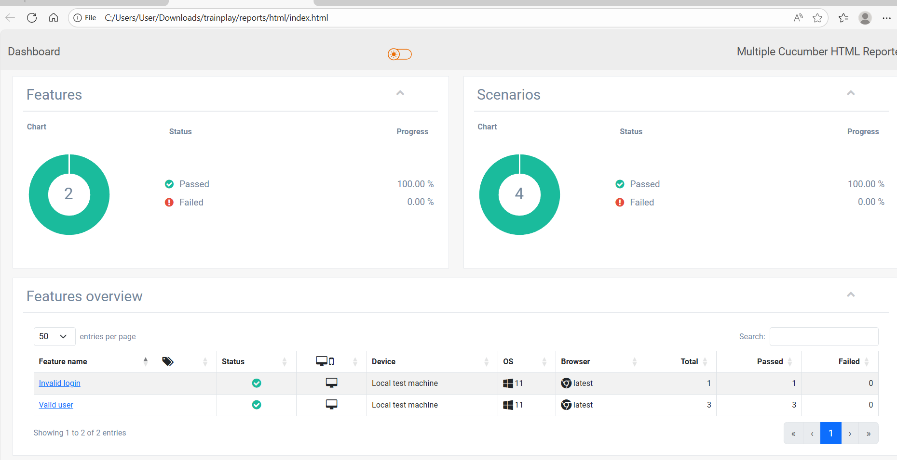

Steps to run the test cases:
1. Clone the code using repo github.com:Neelima202515/Westpac--assessment.git

`
git clone github.com:Neelima202515/Westpac--assessment.git
`

2. Use below command to run and generate the report

`
npx cucumber-js --require steps/**/*.ts --format json:reports/cucumber-report.json
`

`
node report.js
`

Sample report screenshot:

